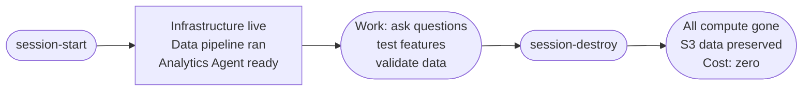
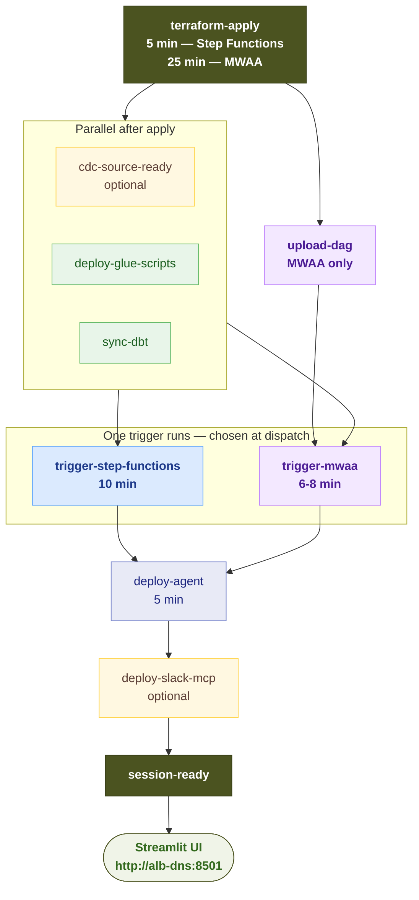
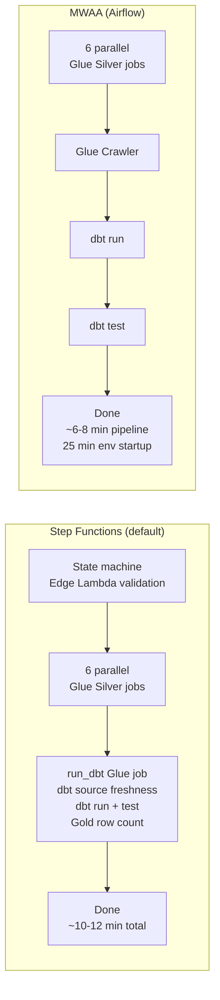
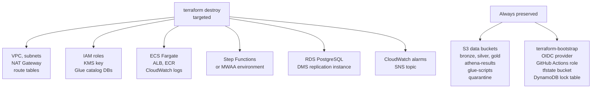

> **Prefer a visual version?** Open the [responsive HTML README](https://enterprise-data-platform-emeka.github.io/platform-session-orchestrator/html/?v=latest).

# platform-session-orchestrator

This repo is the lifecycle controller for the Enterprise Data Platform (EDP). It doesn't contain application code — it contains two GitHub Actions (GHA) workflows that start and destroy a full EDP session across all component repos.

Every session follows the same pattern: apply infrastructure, run the data pipeline, query Gold data, then destroy. I run the orchestrator at the start and end of each work session rather than leaving cloud resources running.

---

## How a session works



A typical 2 to 3 hour session costs around $1.50 to $2.50 total. S3 (Simple Storage Service) buckets are preserved across sessions so Bronze, Silver, and Gold data accumulates over time without paying for idle compute.

---

## Workflows

### session-start.yml

Orchestrates a full session from scratch. It checks out each component repo using a GitHub PAT (Personal Access Token), runs the relevant deploy steps, and confirms the platform is ready before finishing.

**Job dependency graph:**



**Inputs:**

| Input | Type | Default | Description |
|---|---|---|---|
| `env` | choice | `dev` | Target environment: `dev`, `staging`, or `prod` |
| `orchestrator` | choice | `step-functions` | `step-functions` for fast startup (~10 min). `mwaa` for visual Airflow task graph (~6-8 min pipeline, but 25 min environment startup) |
| `serving_layer` | choice | `athena-only` | `athena-only` keeps Gold data in Athena/S3. `redshift-bi` creates Redshift Serverless |
| `run_cdc_simulator` | boolean | `false` | Seeds RDS (Relational Database Service), starts DMS (Database Migration Service), and runs bounded live CDC (Change Data Capture) injection |
| `cdc_simulator_duration_minutes` | choice | `10` | Duration of live CDC injection after bootstrap: 5, 10, 15, 30, or 60 minutes |
| `deploy_slack_mcp` | boolean | `false` | Builds and deploys the Slack MCP (Model Context Protocol) gateway after the Analytics Agent |

**What each job does:**

1. **terraform-apply** — checks out `terraform-platform-infra-live` and applies all infrastructure for the chosen environment. Passes TF_VAR overrides based on the selected orchestrator, serving layer, and optional modules. Exports Terraform outputs (ALB (Application Load Balancer) DNS, CDC cluster details, RDS identifier) for downstream jobs.

2. **cdc-source-ready** (optional) — builds and pushes the CDC simulator image to ECR (Elastic Container Registry), runs schema + seed bootstrap as an ECS (Elastic Container Service) Fargate task, reboots RDS to activate logical replication, starts DMS, and polls Bronze S3 until Parquet files appear for all six source tables.

3. **deploy-glue-scripts** (parallel) — packages `lib/` into `lib.zip`, syncs all job scripts to the Glue scripts S3 bucket, and upserts Glue job definitions for the six Silver jobs.

4. **sync-dbt** (parallel) — syncs the dbt project to S3. For Step Functions: Bronze bucket at `dbt/platform-dbt-analytics/`. For MWAA: the MWAA DAGs bucket at `dbt/platform-dbt-analytics/`. The runtime job downloads from there.

5. **upload-dag** (MWAA only, parallel) — asserts the MWAA environment is AVAILABLE, then syncs `dags/` to the MWAA DAGs bucket.

6. **trigger-step-functions** or **trigger-mwaa** — starts the pipeline and polls until success or failure (30 min timeout, 30 s interval).

7. **deploy-agent** — builds the Analytics Agent Docker image, tags it with the commit SHA, pushes to ECR, registers a new ECS task definition revision, and deploys it via rolling update. Waits for service stability.

8. **deploy-slack-mcp** (conditional) — seeds Slack tokens into Secrets Manager, builds and pushes the gateway image, deploys to ECS, and scales the service to one task.

9. **session-ready** — prints the Streamlit UI URL and FastAPI curl example.

---

**Orchestrator comparison:**



Use Step Functions for every regular session. It starts in 5 minutes and costs less. Use MWAA when you need the visual Airflow task dependency graph or want to validate the full Airflow orchestration path.

---

### session-destroy.yml

Tears down all session compute resources. S3 data buckets are preserved intentionally.

**Inputs:**

| Input | Required | Description |
|---|---|---|
| `env` | yes | Environment to destroy: `dev`, `staging`, or `prod` |
| `db_password` | yes | RDS master password (needed for Terraform variable validation even if CDC was not used) |
| `redshift_admin_password` | yes | Redshift admin password (same reason) |
| `confirm` | yes | Must type `destroy` exactly. Anything else skips the job entirely |

**What it destroys vs preserves:**



The destroy uses `make destroy-safe` which dynamically discovers all modules in Terraform state and targets them for deletion, excluding `module.data_lake`. S3 buckets are never deleted by the workflow.

---

## Prerequisites

These are one-time setup steps. Once done, the workflows run without any manual AWS CLI commands.

1. **terraform-bootstrap** applied in each account (dev, staging, prod). This creates the OIDC (OpenID Connect) provider, `edp-{env}-github-actions-role`, the Terraform state S3 bucket, and the DynamoDB lock table.

2. **terraform-github-setup** applied. This creates GitHub Environments (`dev`, `staging`, `prod`) and sets the `AWS_ACCOUNT_ID` variable in each.

3. **`GH_PAT` secret** added to each GitHub Environment. This is a GitHub Personal Access Token with `repo` scope. The workflows use it to check out other repos in the `enterprise-data-platform-emeka` org.

---

## Secrets and variables

All secrets are scoped per GitHub Environment (Settings > Environments > {env}).

**Required secrets:**

| Secret | When required |
|---|---|
| `GH_PAT` | Always — cross-repo checkout |
| `DB_PASSWORD` | When `run_cdc_simulator=true` |
| `REDSHIFT_ADMIN_PASSWORD` | When `serving_layer=redshift-bi` (and always for destroy) |
| `SLACK_APP_TOKEN` | When `deploy_slack_mcp=true` |
| `SLACK_BOT_TOKEN` | When `deploy_slack_mcp=true` |

**Required variables:**

| Variable | Description |
|---|---|
| `AWS_ACCOUNT_ID` | 12-digit AWS account ID for the environment |

**SSM (Systems Manager) parameters** (set once per environment via AWS CLI):

```bash
aws ssm put-parameter \
  --name "/edp/{env}/anthropic_api_key" \
  --type "SecureString" \
  --value "YOUR_KEY" \
  --profile {env}-admin \
  --region eu-central-1
```

---

## Typical session sequence

**Step Functions session (fast, use this for most sessions):**

```
1. session-start.yml (env=dev, orchestrator=step-functions)  ~24 min total
   ├── terraform-apply                                         ~5 min
   ├── deploy-glue-scripts + sync-dbt (parallel)              ~30 sec
   ├── trigger-step-functions                                  ~10 min
   └── deploy-agent                                           ~5 min

2. Open http://{alb_dns}:8501 in browser
3. Ask questions against Gold data

4. session-destroy.yml (env=dev, confirm=destroy)            ~5 min
```

**MWAA session (use when Airflow UI is needed):**

```
1. session-start.yml (env=dev, orchestrator=mwaa)            ~40 min total
   ├── terraform-apply (includes MWAA startup)               ~25 min
   ├── deploy-glue-scripts + sync-dbt + upload-dag (parallel) ~30 sec
   └── trigger-mwaa + deploy-agent                           ~12 min

2. Open Airflow UI at the MWAA environment web server URL
3. Open http://{alb_dns}:8501 for the Analytics Agent

4. session-destroy.yml (env=dev, confirm=destroy)            ~5 min
```

---

## Cost reference

| Item | Cost |
|---|---|
| Full dev/staging session (2-3 hr) | ~$1.50-$2.50 |
| DMS replication instance | ~$0.10/hr |
| RDS PostgreSQL | ~$0.02/hr |
| Per Analytics Agent question | ~$0.016 (Claude API ~$0.015 + Athena ~$0.001) |
| S3 storage between sessions | Negligible at demo data volumes |

terraform-bootstrap resources (OIDC, tfstate bucket, DynamoDB lock table) are permanent and have no meaningful idle cost.

---

## Repository structure

```
platform-session-orchestrator/
└── .github/
    └── workflows/
        ├── session-start.yml    # Full session startup (9 jobs)
        └── session-destroy.yml  # Targeted teardown with confirmation guard
```

There is no application code in this repo. All logic is in the GitHub Actions workflow YAML files, which coordinate the other platform repos via cross-repo checkout.
