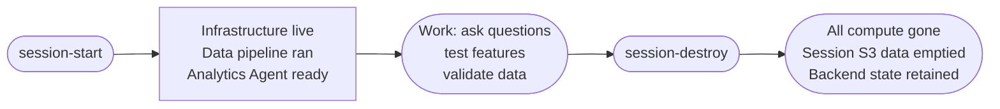
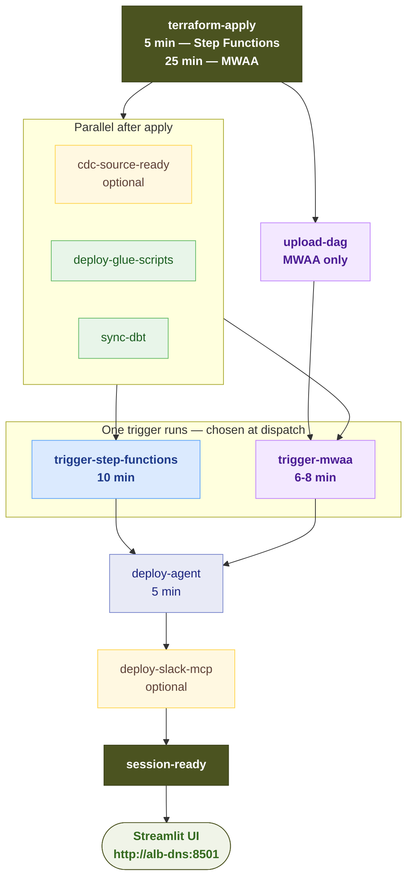
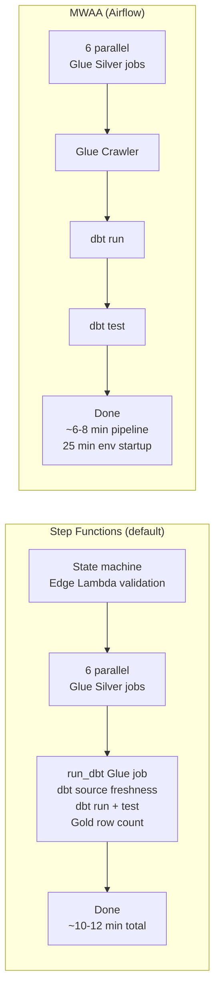
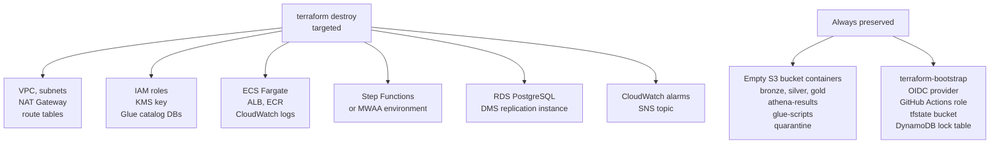
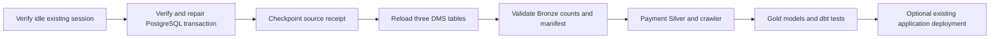

> **Prefer a visual version?** Open the [responsive HTML README](https://enterprise-data-platform-emeka.github.io/platform-session-orchestrator/html/?v=latest).

# platform-session-orchestrator

This repo is the lifecycle controller for the Enterprise Data Platform (EDP). It doesn't contain application code — it contains two GitHub Actions (GHA) workflows that start and destroy a full EDP session across all component repos.

Every session follows the same pattern: apply infrastructure, run the data pipeline, query Gold data, then destroy. I run the orchestrator at the start and end of each work session rather than leaving cloud resources running.

---

## How a session works


```mermaid
flowchart LR
    A([session-start]) --> B[Infrastructure live\nData pipeline ran\nAnalytics Agent ready]
    B --> C([Work: ask questions\ntest features\nvalidate data])
    C --> D([session-destroy])
    D --> E([All compute gone\nSession S3 data emptied\nBackend state retained])
```

Session Destroy empties session S3 (Simple Storage Service) data, including all object versions. Empty data-lake buckets and Terraform backend state remain. Storage and compute costs are measured per session; retained backend state and logs can still be billed.

---

## Workflows

### session-start.yml

Orchestrates a full session from scratch. It checks out each component repo using a GitHub PAT (Personal Access Token), runs the relevant deploy steps, and confirms the platform is ready before finishing.

**Job dependency graph:**


```mermaid
flowchart TD
    TF["terraform-apply\n5 min — Step Functions\n25 min — MWAA"]:::infra

    subgraph PREP["Parallel after apply"]
        direction LR
        CDC["cdc-source-ready\noptional"]:::opt
        GLUE["deploy-glue-scripts"]:::fast
        DBT["sync-dbt"]:::fast
    end
    DAG["upload-dag\nMWAA only"]:::mwaanode

    TF --> PREP
    TF --> DAG

    subgraph CHOICE["One trigger runs — chosen at dispatch"]
        direction LR
        SFN["trigger-step-functions\n10 min"]:::sfn
        MWAA_T["trigger-mwaa\n6-8 min"]:::mwaanode
    end

    PREP --> SFN
    PREP --> MWAA_T
    DAG --> MWAA_T

    SFN --> AGENT["deploy-agent\n5 min"]:::deploy
    MWAA_T --> AGENT

    AGENT --> SLACK["deploy-slack-mcp\noptional"]:::opt
    SLACK --> READY["session-ready"]:::ready
    READY --> UI(["Streamlit UI\nhttp://alb-dns:8501"]):::ui

    classDef infra   fill:#4B5320,stroke:#3a4119,color:#fff,font-weight:bold
    classDef fast    fill:#e8f5e9,stroke:#66bb6a,color:#1b5e20
    classDef opt     fill:#fff8e1,stroke:#ffd54f,color:#5d4037
    classDef sfn     fill:#dbeafe,stroke:#60a5fa,color:#1e3a8a,font-weight:bold
    classDef mwaanode fill:#f3e8ff,stroke:#c084fc,color:#4c1d95,font-weight:bold
    classDef deploy  fill:#e8eaf6,stroke:#7986cb,color:#1a237e
    classDef ready   fill:#4B5320,stroke:#3a4119,color:#fff,font-weight:bold
    classDef ui      fill:#f0f4e8,stroke:#4B5320,color:#33691e,font-weight:bold
```

**Inputs:**

| Input | Type | Default | Description |
|---|---|---|---|
| `env` | choice | `dev` | Target environment: `dev`, `staging`, or `prod` |
| `orchestrator` | choice | `step-functions` | `step-functions` for fast startup (~10 min). `mwaa` for visual Airflow task graph (~6-8 min pipeline, but 25 min environment startup) |
| `serving_layer` | choice | `athena-only` | `athena-only` keeps Gold data in Athena/S3. `redshift-bi` creates Redshift Serverless |
| `data_mode` | choice | `seed-only` | Historical seed without live injection; `seed-and-live` enables bounded injection; `reuse-retained` requires existing same-day data |
| `seed_profile` | choice | `customer-intelligence-36m` | 20,000 customers, 1,500 products, 300,000 orders; `smoke` selects the smaller fixture |
| `cdc_simulator_duration_minutes` | choice | `10` | Duration of live CDC injection after bootstrap: 5, 10, 15, 30, or 60 minutes |
| `deploy_slack_mcp` | boolean | `false` | Builds and deploys the Slack MCP (Model Context Protocol) gateway after the Analytics Agent |

**What each job does:**

1. **terraform-apply** — checks out `terraform-platform-infra-live` and applies all infrastructure for the chosen environment. Passes TF_VAR overrides based on the selected orchestrator, serving layer, and optional modules. Exports Terraform outputs (ALB (Application Load Balancer) DNS, CDC cluster details, RDS identifier) for downstream jobs.

2. **cdc-source-ready** (optional) — builds and pushes the CDC simulator image to ECR (Elastic Container Registry), runs schema + seed bootstrap as an ECS (Elastic Container Service) Fargate task, reboots RDS to activate logical replication, starts DMS, and validates the current full load across eight source tables, including history and manifest. Seed-only stops the DMS task afterwards; seed-and-live starts bounded injection.

3. **deploy-glue-scripts** (parallel) — packages `lib/` into `lib.zip`, syncs all job scripts to the Glue scripts S3 bucket, and upserts Glue job definitions for the six Silver jobs.

4. **sync-dbt** (parallel) — syncs the dbt project to S3. For Step Functions: Bronze bucket at `dbt/platform-dbt-analytics/`. For MWAA: the MWAA DAGs bucket at `dbt/platform-dbt-analytics/`. The runtime job downloads from there.

5. **upload-dag** (MWAA only, parallel) — asserts the MWAA environment is AVAILABLE, then syncs `dags/` to the MWAA DAGs bucket.

6. **trigger-step-functions** or **trigger-mwaa** — starts the pipeline and polls until success or failure (30 min timeout, 30 s interval).

7. **deploy-agent** — builds the Analytics Agent Docker image, tags it with the commit SHA, pushes to ECR, registers a new ECS task definition revision, and deploys it via rolling update. Waits for service stability.

8. **deploy-slack-mcp** (conditional) — seeds Slack tokens into Secrets Manager, builds and pushes the gateway image, deploys to ECS, and scales the service to one task.

9. **session-ready** — prints the Streamlit UI URL and FastAPI curl example.

---

**Orchestrator comparison:**


```mermaid
flowchart LR
    subgraph SFN["Step Functions (default)"]
        direction TB
        S1[State machine\nEdge Lambda validation] --> S2[6 parallel\nGlue Silver jobs] --> S3[run_dbt Glue job\ndbt source freshness\ndbt run + test\nGold row count] --> S4[Done\n~10-12 min total]
    end

    subgraph MWAA["MWAA (Airflow)"]
        direction TB
        M1[6 parallel\nGlue Silver jobs] --> M2[Glue Crawler] --> M3[dbt run] --> M4[dbt test] --> M5[Done\n~6-8 min pipeline\n25 min env startup]
    end
```

Use Step Functions for every regular session. It starts in 5 minutes and costs less. Use MWAA when you need the visual Airflow task dependency graph or want to validate the full Airflow orchestration path.

---

### session-destroy.yml

Tears down all session compute resources. S3 data-lake bucket containers remain, but their contents, versions, and incomplete multipart uploads are permanently removed.

**Inputs:**

| Input | Required | Description |
|---|---|---|
| `env` | yes | Environment to destroy: `dev`, `staging`, or `prod` |
| `db_password` | yes | RDS master password (needed for Terraform variable validation even if CDC was not used) |
| `redshift_admin_password` | yes | Redshift admin password (same reason) |
| `confirm` | yes | Must type `destroy` exactly. Anything else skips the job entirely |

**What it destroys vs preserves:**


```mermaid
flowchart TD
    DESTROY[terraform destroy\ntargeted] --> NET[VPC, subnets\nNAT Gateway\nroute tables]
    DESTROY --> IAM[IAM roles\nKMS key\nGlue catalog DBs]
    DESTROY --> COMPUTE[ECS Fargate\nALB, ECR\nCloudWatch logs]
    DESTROY --> ORCH[Step Functions\nor MWAA environment]
    DESTROY --> INGEST[RDS PostgreSQL\nDMS replication instance]
    DESTROY --> MON[CloudWatch alarms\nSNS topic]

    PRESERVE[Always preserved] --> S3[Empty S3 bucket containers\nbronze, silver, gold\nathena-results\nglue-scripts\nquarantine]
    PRESERVE --> BOOT[terraform-bootstrap\nOIDC provider\nGitHub Actions role\ntfstate bucket\nDynamoDB lock table]
```

The destroy uses `make destroy-safe` which dynamically discovers all modules in Terraform state and targets them for deletion, excluding `module.data_lake`. The data-lake buckets remain; their data is permanently deleted after successful runtime teardown. The optional MWAA bucket follows its owning module.

---

## Prerequisites

These are one-time setup steps. Once done, the workflows run without any manual AWS CLI commands.

1. **terraform-bootstrap** applied in each account (dev, staging, prod). This creates the OIDC (OpenID Connect) provider, `edp-{env}-github-actions-role`, the Terraform state S3 bucket, and the DynamoDB lock table.

2. **terraform-github-setup** applied. This creates GitHub Environments (`dev`, `staging`, `prod`) and sets the `AWS_ACCOUNT_ID` variable in each.

3. **`GH_PAT` secret** added to each GitHub Environment. This is a GitHub Personal Access Token with `repo` scope. The workflows use it to check out other repos in the `enterprise-data-platform-emeka` org.

---

## Secrets and variables

All secrets are scoped per GitHub Environment (Settings > Environments > {env}).

**Required secrets:**

| Secret | When required |
|---|---|
| `GH_PAT` | Always — cross-repo checkout |
| `DB_PASSWORD` | When `data_mode` is `seed-only` or `seed-and-live` |
| `REDSHIFT_ADMIN_PASSWORD` | When `serving_layer=redshift-bi` (and always for destroy) |
| `SLACK_APP_TOKEN` | When `deploy_slack_mcp=true` |
| `SLACK_BOT_TOKEN` | When `deploy_slack_mcp=true` |

**Required variables:**

| Variable | Description |
|---|---|
| `AWS_ACCOUNT_ID` | 12-digit AWS account ID for the environment |
| `CLAUDE_PROVIDER` | Optional rollback switch. Omit it for Claude Platform on AWS, or set `anthropic_api_key` only if rolling back. |

**SSM (Systems Manager) parameters** (set once per environment via AWS CLI):

```bash
aws ssm put-parameter \
  --name "/edp/{env}/anthropic_api_key" \
  --type "SecureString" \
  --value "<anthropic-api-key>" \
  --profile {env}-admin \
  --region eu-central-1
```

Claude Platform on AWS is the default for new sessions. Store the workspace ID in SSM, not in GitHub variables or workflow inputs:

```bash
aws ssm put-parameter \
  --name "/edp/{env}/claude/workspace_id" \
  --type "String" \
  --value "<workspace-id>" \
  --overwrite \
  --profile {env}-admin \
  --region eu-central-1
```

The session workflow sets `TF_VAR_claude_provider=aws_claude_platform` by default and does not print the workspace ID or secret values in Terraform logs.

---

## Typical session sequence

**Step Functions session (fast, use this for most sessions):**

```
1. session-start.yml (env=dev, orchestrator=step-functions)  ~24 min total
   ├── terraform-apply                                         ~5 min
   ├── deploy-glue-scripts + sync-dbt (parallel)              ~30 sec
   ├── trigger-step-functions                                  ~10 min
   └── deploy-agent                                           ~5 min

2. Open http://{alb_dns}:8501 in browser
3. Ask questions against Gold data

4. session-destroy.yml (env=dev, confirm=destroy)            ~5 min
```

**MWAA session (use when Airflow UI is needed):**

```
1. session-start.yml (env=dev, orchestrator=mwaa)            ~40 min total
   ├── terraform-apply (includes MWAA startup)               ~25 min
   ├── deploy-glue-scripts + sync-dbt + upload-dag (parallel) ~30 sec
   └── trigger-mwaa + deploy-agent                           ~12 min

2. Open Airflow UI at the MWAA environment web server URL
3. Open http://{alb_dns}:8501 for the Analytics Agent

4. session-destroy.yml (env=dev, confirm=destroy)            ~5 min
```

---

## Cost reference

| Item | Cost |
|---|---|
| Full dev/staging session (2-3 hr) | ~$1.50-$2.50 |
| DMS replication instance | ~$0.10/hr |
| RDS PostgreSQL | ~$0.02/hr |
| Per Analytics Agent question | ~$0.016 (Claude API ~$0.015 + Athena ~$0.001) |
| S3 storage between sessions | Negligible at demo data volumes |

terraform-bootstrap resources (OIDC, tfstate bucket, DynamoDB lock table) are permanent and have no meaningful idle cost.

---

## Repository structure

```
platform-session-orchestrator/
└── .github/
    └── workflows/
        ├── session-start.yml    # Full session startup (9 jobs)
        └── session-destroy.yml  # Targeted teardown with confirmation guard
```

There is no application code in this repo. All logic is in the GitHub Actions workflow YAML files, which coordinate the other platform repos via cross-repo checkout.

## Daily seed and cleanup contract

Default historical interval: 2023-09-01 inclusive to 2026-09-01 exclusive,
seed 42, generator `customer-history-v1`. The source manifest verifies identity
and counts; a different or partial source fails instead of silently appending.
Seeding requires an empty Bronze `raw/` prefix. A new full load must finish with
expected counts before either downstream orchestrator starts. Live duration is
ignored in seed-only mode. Stopping a DMS task does not stop instance billing.

Session Destroy's existing `destroy` confirmation now includes irreversible
session data deletion. All versions, delete markers and multipart uploads in
the six data-lake buckets and optional MWAA bucket are removed. A cleanup failure
fails the run. Terraform backend state is excluded; no arbitrary bucket purge
is accepted. Export required evidence to local storage before teardown.
`reuse-retained` fails after daily cleanup. Both workflows share a concurrency
group; do not run separate deployment workflows during teardown.

Rollout order: simulator, infrastructure, Glue and dbt, then this workflow.
Start with `seed_profile=smoke`, verify startup and teardown, then run the full
profile. Infrastructure configures the seed task with 1 vCPU and 2 GiB.

Validation: `python -m pytest tests -q` after installing pytest, PyYAML and boto3.

## Recover an existing session

Use **Actions → Session Recover → Run workflow** after merging fixes. This workflow
uses the existing Step Functions session; it does not apply Terraform, reboot RDS,
reseed the database, or rebuild the whole platform.

| Scope | Work performed |
|---|---|
| `gold` | Refresh merged dbt/Glue code and run Gold models and tests |
| `silver-and-gold` | Rerun the selected Silver job, verify the crawler, then Gold |
| `repair-seed-payments` | Repair canonical v1 payment methods in PostgreSQL; reload payments, seed event history and manifest; rerun payment Silver and Gold |

For the historical seed payment failure, merge the simulator's `feat/session-recovery`
branch first, then this repository's branch. Select `env=dev`,
`scope=repair-seed-payments`, and enable application deployment. Select the web
option if that service was provisioned by Session Start. All code checkouts use
merged `main`; a pull request alone does not deploy a fix.


```mermaid
flowchart LR
  A[Verify idle existing session] --> B[Verify and repair PostgreSQL transaction]
  B --> C[Checkpoint source receipt]
  C --> D[Reload three DMS tables]
  D --> E[Validate Bronze counts and manifest]
  E --> F[Payment Silver and crawler]
  F --> G[Gold models and dbt tests]
  G --> H[Optional existing application deployment]
```

Recovery requires the seed-only readiness marker, existing source/runtime resources,
versioned Bronze, and idle source tasks, Glue jobs, crawler and Step Functions.
It refuses an existing MWAA environment; this recovery workflow currently supports
Step Functions sessions only. No live injection should be started while recovering.
The workflow shares the Start/Destroy concurrency group. Other repositories and
manual AWS operations must also remain idle.

The source repair accepts only canonical v1 or v2 synthetic datasets. It verifies
all source rows under database write locks and updates payment snapshots, history
payloads and manifest in one transaction. Changed datasets are rejected. A repeated
repair verifies the completed v2 dataset instead of applying another update.

The private Bronze journal at `metadata/recovery/payment-method-v2.json` records
progress. A retry after Bronze validation skips source repair and DMS loading;
a retry after successful Silver skips Silver when its code revision is unchanged.
Gold always reruns its validations. If a source task is still running after a workflow
cancellation, wait for it to stop and inspect its CloudWatch log before retrying.
The helper does not kill running tasks. If a DMS reload was interrupted, the same
repair scope stops DMS and repeats only the three affected tables.

Before replacing affected Bronze objects, recovery saves their version IDs under
`metadata/recovery/backups/`. It adds delete markers rather than deleting original
versions. Only newly loaded `LOAD*.parquet` snapshot files are kept current for the
three repaired tables; migration CDC files are hidden after DMS stops. Actual Parquet
row counts, payment methods and the source receipt must match before processing.
This follows the [DMS table reload requirements](https://docs.aws.amazon.com/dms/latest/userguide/CHAP_Tasks.ReloadTables.html)
and [S3 full-load/CDC file conventions](https://docs.aws.amazon.com/dms/latest/userguide/CHAP_Target.S3.html).
Backup versions remain until daily Session Destroy empties the session buckets.
Terraform backend state remains excluded from that cleanup.

An incomplete repair blocks other recovery scopes. Inspect the private simulator,
DMS or Glue CloudWatch logs for the failed stage; do not manually mark checkpoints
complete. Select the same repair scope to resume. `reuse-retained` is retired from
Session Start because it could apply infrastructure changes to an existing session.
Use Session Recover for processing fixes, and Session Destroy for end-of-day cleanup.

Local verification: `python -m pytest tests/`. Cloud execution remains a controlled
smoke test after merge; local tests do not establish live DMS/ECS success.
